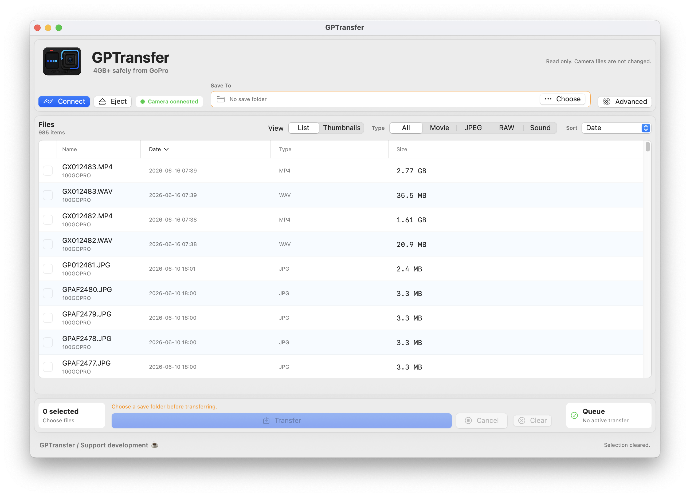
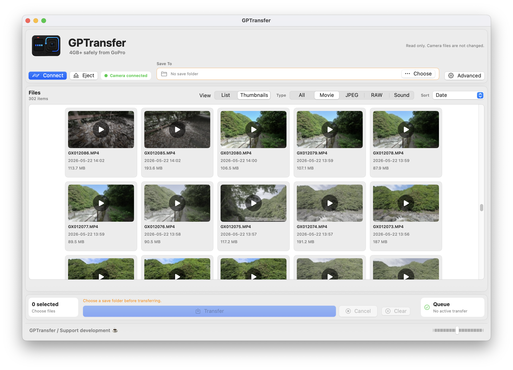
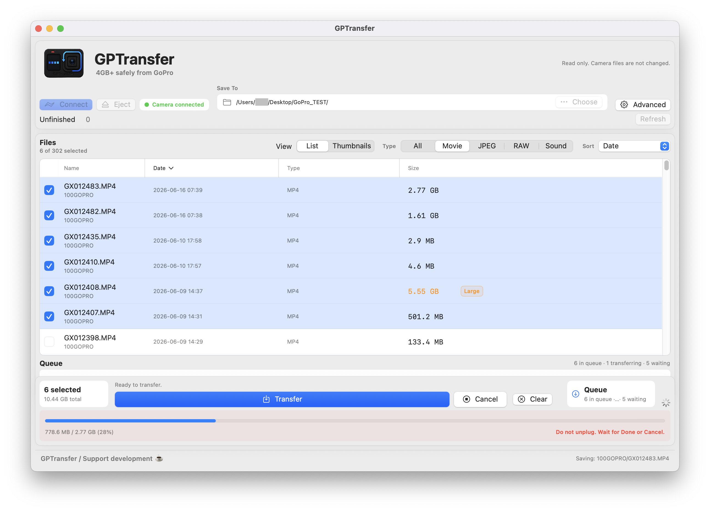

# GPTransfer

GPTransfer is an independent macOS app for safely transferring GoPro files to a Mac.

It is designed for large GoPro files, including 4GB+ videos, JPG/JPEG photos, RAW/GPR sidecar files, and WAV/audio sidecar files. Camera files are treated as read only and are not changed by the app.

GPTransfer is not affiliated with, sponsored by, or endorsed by GoPro. GoPro is a trademark of GoPro, Inc.

## Screenshots

### List View



### Thumbnail View



### Transfer Queue



## Features

- Transfer large GoPro files, including 4GB+ videos
- Support for MP4, JPG/JPEG, GPR, and WAV files
- List and thumbnail views
- Multi-select transfer with queue display
- Per-file transfer progress
- Finder drag transfer for supported regular video files
- Duplicate file warning before replacing files
- Safe `.partial` temporary files during transfer
- Size verification before completed files are finalized
- Unfinished `.partial` file detection
- Transfer Log for troubleshooting
- Optional auto launch when a camera is connected
- Read-only access to camera files

## Safety

GPTransfer is built around a conservative transfer model:

- Camera files are not deleted or modified
- Transfers are written first as `.partial` files
- Completed transfers are verified before finalizing
- Existing destination files are not silently overwritten
- Canceled or interrupted transfers are not marked as complete
- Remaining `.partial` files can be reviewed before removal

## Supported Files

GPTransfer currently supports:

- MP4 video files
- JPG/JPEG photo files
- GPR RAW sidecar files
- WAV/audio sidecar files

File availability can vary depending on the camera model, shooting mode, camera settings, firmware behavior, and how the camera exposes files through its local media interface.

## Camera Compatibility

GPTransfer is intended for GoPro cameras that expose media through the local GoPro media interface.

In practice, a camera is in scope when GPTransfer can reach the camera's media list endpoint, such as `/gopro/media/list`, over the camera's local USB or network connection.

Currently in scope:

- GoPro HERO-family cameras and similar GoPro models that expose the local GoPro media interface
- GoPro connection modes where the Mac receives a local camera network address and the app can load the media list

Currently out of scope:

- GoPro Lit
- GoPro cameras or connection modes that appear only as a USB device and do not expose the local GoPro media interface
- GoPro cameras or connection modes that do not appear as a Finder-readable storage volume and do not expose the local GoPro media interface

Compatibility is determined by the connection mode and exposed media interface, not by the camera name alone.

## Requirements

- macOS 13 or later
- A GoPro camera that exposes media through the local GoPro media interface
- USB or local network connectivity between the Mac and the camera

## Download

Download the latest release from the official release page:

[Latest GPTransfer release](https://github.com/omokage-code/GPTransfer/releases/latest)

Use `v0.1.1` or later. The first `v0.1.0` package was superseded by `v0.1.1` because macOS could incorrectly report the downloaded app as damaged.

## Build

```bash
./scripts/build_app_bundle.sh
```

The app bundle is created at:

```text
dist/GPTransfer.app
```

## Installation

The first public builds of GPTransfer may be unsigned and not notarized.

If macOS says the app cannot be opened because Apple cannot check it for malicious software, this is expected for the unsigned GitHub build.

To open the app:

1. Open Finder.
2. Control-click or right-click `GPTransfer.app`.
3. Choose `Open`.
4. Choose `Open` again if macOS asks for confirmation.

If macOS still blocks the app:

1. Open `System Settings`.
2. Open `Privacy & Security`.
3. Find the GPTransfer warning near the bottom.
4. Choose `Open Anyway`.

Only open builds downloaded from the official project release page.

## Basic Use

1. Connect the GoPro to the Mac.
2. Open GPTransfer.
3. Wait for the camera files to load, or press `Connect` if needed.
4. Choose a save folder.
5. Select one or more files.
6. Press `Transfer`.
7. Wait for the transfer to complete before disconnecting the camera.

If `Open when camera is connected` is enabled, GPTransfer installs a user LaunchAgent and can open automatically when a camera connection is detected. This setting is off by default.

## Notes and Limitations

- GPTransfer does not mount a GoPro as an external SSD.
- GPTransfer does not currently support GoPro Lit.
- GPTransfer does not merge chaptered video files.
- GPTransfer does not upload files to the cloud.
- Finder drag transfer is intended for supported regular video files. Grouped photo sequences should be transferred with the app's transfer flow.
- Some camera modes may expose grouped photos, RAW files, or sidecar files differently.
- If a file does not appear, reconnect the camera and reload the file list.
- If a transfer is interrupted, check for `.partial` files before retrying.

## Privacy

GPTransfer performs transfers locally between the connected camera and the selected folder on your Mac. See [PRIVACY.md](PRIVACY.md).

## Support Development

GPTransfer is free and open source. If you find it useful, please consider supporting development.

If GPTransfer helps your workflow, you can support development here:

[buymeacoffee.com/omokage](https://buymeacoffee.com/omokage)

## License

GPTransfer is released under the [MIT License](LICENSE).
